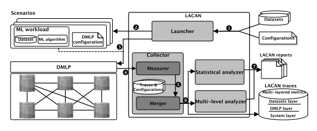
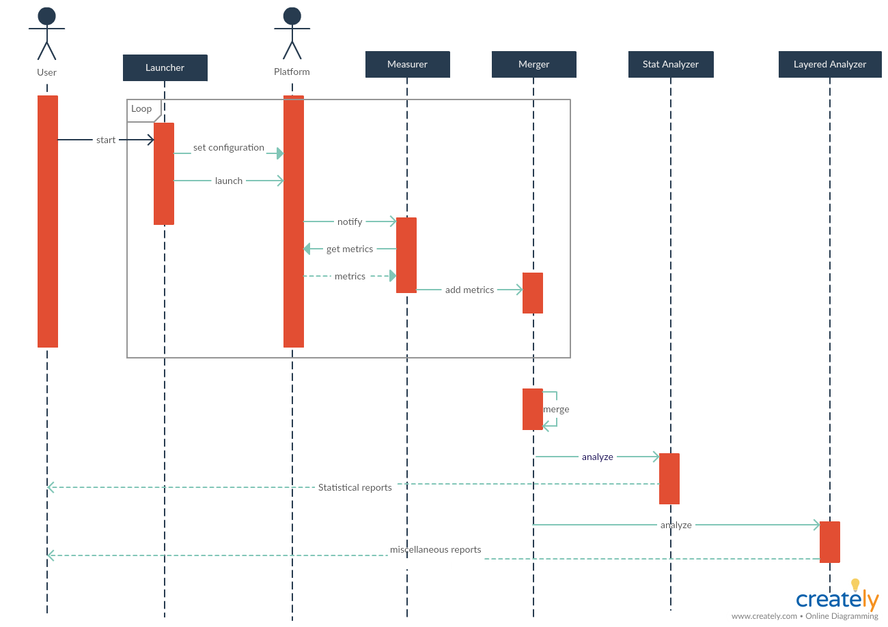

# LACAN (machine LeArning workload ChAractreizatioN)

LACAN is a framework built on top of [Apache Spark](https://spark.apache.org/) that allows the automatic deployment of distributed machine learning workloads beside the collection of the low-level execution metrics (such as CPU usage, memory consumption, disk and network bandwidth) and the statistical and the multi-level characterization corresponding to those metrics. The goal is to understand the behavior of machine learning workloads in a distributed environment, find the corresponding bottlenecks, and suggest the best configuration that yields the optimal execution.

## Architecture

The following figure illustrates the general architecture of LACAN:



Here we detail the components of LACAN:

1. The inputs:
LACAN inputs are threefold. First there is the datasets that the user wants to use in the training of ML models. Second there is the ML algorithms thast the user wants to use. And finally, the configuations to be tested with in order to undrestand the impact of Spark configuration parameters over the overall execution time.

2. The outputs:
LACAN deploys a set of scenarios that is the cartesian product of the three inputs. This means that LACAN submits workloads for each possible triplet of (dataset, algorithm, configuration). As output, LACAN produces the low-level execution metrics in the form of traces. Also, it generates some statistical reports to be used in order to characterize the workloads, in addition to some multi-level analyses.

3. The Launcher:
This component is responsible for reading the input configuration file (that contains the set of datasets, algorithms and parameters), construct the cartesian product of these three sets, and for each element in the cartesian product, submits the corresponding workload on the Apache Spark framework.

4. The Measurer:
It is the entity that is in charge of collecting the low level metrics of Spark. After the end of each [task](http://static.usenix.org/events/hotcloud10/tech/full_papers/Zaharia.pdf), the Measurer probes a custom listener that we built in Spark, that would listen to the task completion event and gives back a vector of low-level measures. The measures that we collected are available [here](https://docs.google.com/spreadsheets/d/11IRZLGg5-my0g6qKA2tYGBLYoKbmTyRj5CD45C0ExgQ/edit#gid=0)

5. The Merger:
It is tightly related to the Measurer in that in merges the measure vector into the full traces dataset that is going to be sent back to the user at the end of the experiments.

6. The statistical analyzer:
This component takes the traces and applies some statistical analysis on them. Amon gthe analyses is the coputation of the measures of center (mean, mode, median), the measures of spread (maximum, minimum, interquartile range, variance, standard deviation) and the measures of shape (density distribution function for each random variable).

7. The multi-level analyzer:
This component, instead of considering each variable alone, tries to explore the relationships between the metrics and the target variable which is the overall execution time. The associations can be unearthed by measures of correlation and regression.

The following sequence diagram depicts the interactions between the differet actors of LACAN.



## Deployment I

For now, we only deploy LACAN on the [grid5000 cluster](https://www.grid5000.fr/w/Grid5000:Home).
All the scripts for deployment are in the deployment folder of this repository.
First you need to make sure that the Spark master and worker images are in your home folder of your grid5000 account at the path xp/images.

To make a grid5000 reservation, run the following command:
```bash
oarsub -I -t deploy -l -l {"rconsole='YES'"}/nodes=n,walltime=t -p "cluster='c'"
```
where n is the number of nodes, t is the time of reservation and c is the cluster name. Please note that it is mandatory that the nodes belong to the same cluster because the nodes are connected with private IP addresses, and the automation scripts are limited to that.

After reserving the nodes on the distributed cluster, it is time to install the Spark images on the nodes, and configure the platform accordingly. To do this, run the "deploy.sh" script.

```bash
./deployment/deploy.sh
```

After the images got installed, you have to connect to the master node. To know which nod is the master, run the following command:

```bash
uniq $OAR_NODE_FILE
```

The master node is always the first node in the list. Connect to the master and then run the "start_cluster.sh" script.

```bash
./deployment/start_cluster.sh
```

This script will be responsible for launching Spark and Hadoop on each node and then put the datasets in HDFS.
LACAN is now installed and your distributed cluster is set up.

## Deployment II

The scripts were designed using the old MLlib-XP repository hierarchy. Although we changed all the paths, this new organization remains experimental.

This script will automatically call deploy.sh for each subgroup (datasets have to be in the xp/data folder).

```bash
ssh rennes.g5k
cd xp/autoconf
./deploy_all.sh
```

This script will prepare the experiments and automatically call start_cluster.sh (to be executed on the leader of each subgroup).

```bash
ssh root@$leader
su xp
cd
./prepare_experiment.sh
```

To launch the experiments in background according to the specified configuration.

```bash
cd apps/LACAN
nohup python LACAN/src/lacan/experiments/scripts/launch.py --path configurations/ > out &
exit
```

To start fetching the results every minute overnight.

```bash
./sync_all.sh
```

To stop fetching the results.

```bash
./sync_kill.sh
```

To merge the results.

```bash
python LACAN/LACAN/src/lacan/experiments/scripts/merge.py --path LACAN-Data/collected-traces/2019-07-12T18:11:45.685740 --save . --name "applicative|configuration|metrics"
```

To analyze the results.

```bash
cd LACAN/src/lacan/analysis/plots/notebooks
jupyter notebook
```

## Usage

### Running the experiments

In this section, we detail the usage of the system. The power of LACAN is the use of external configuration files. Although the core has been implemented with Scala and stored in the experiment directory, to use LACAN, you only need to tune some external configuration files.

#### Adding a dataset

To add a dataset to the considered workloads, you just have to add a configuration file relative to your dataset in the configurations/datasets folder. Here is the general structure with an example of the dataset configuration file:

```json
{
  "name": "higgs", //name of the dataset
  "types": ["classification", "clustering", "regression"], //the usage of the dataset [Here it is used for classification, clustering and regression]
  "description": {
    "clusters": 2, //the number of clusters in the dataset if it is used for clustering
    "classes": 2, //the number of classes in the dataset if it is used for classification
    "features": 27 //the number of features in the dataset
  },
  "details": {
    "reader": {
      "classname": "fr.insa.lacan.reader.SparkReader", 
      "parameters": {
        "format": "csv", //format of the dataset
        "location": "hdfs://master:9000/data/higgs.csv", //link to the dataset on HDFS on the master node
        "options": {
          "sep": ",", //separator
          "inferSchema": true,
          "header": true //if there is a header
        }
      }
    },
    "transformers": [
      {
        "classname": "org.apache.spark.ml.feature.VectorAssembler",
        "parameters": {
          "inputCols": ["lepton_eta", "lepton_phi", "missing_energy_magnitude", "missing_energy_phi", "jet_1_pt", "jet_1_eta", "jet_1_phi", "jet_1_b-tag", "jet_2_pt", "jet_2_eta", "jet_2_phi", "jet_2_b-tag", "jet_3_pt", "jet_3_eta", "jet_3_phi", "jet_3_b-tag", "jet_4_pt", "jet_4_eta", "jet_4_phi", "jet_4_b-tag", "m_jj", "m_jjj", "m_lv", "m_jlv", "m_bb", "m_wbb", "m_wwbb"], //the names of the features of the dataset
          "outputCol": "raw"
        }
      }
    ],
    "preprocessors": [
      {
        "classname": "org.apache.spark.ml.feature.StandardScaler",
        "parameters": {
          "inputCol": "raw",
          "outputCol": "features",
          "withStd": true,
          "withMean": true
        }
      },
      {
        "classname": "fr.insa.lacan.transformer.ColumnRenamer",
        "parameters": {
          "existingName": "label",
          "newName": "classes"
        }
      },
      {
        "classname": "fr.insa.lacan.transformer.ColumnRenamer",
        "parameters": {
          "existingName": "lepton_pT", //name of the class column in the classification context
          "newName": "y"
        }
      }
    ]
  }
}
```


#### Adding an algorithm

To add an algorithm to the considered workloads, you just have to add a configuration file relative to your algorithm in the configurations/algorithms folder. Here is the general structure with an example of the algorithm configuration file:

```json
{
  "name": "Tree",
  "types": ["classification"], //the family of the ML algorithm
  "details": {
    "estimators": [
      {
        "classname": "org.apache.spark.ml.classification.DecisionTreeClassifier", //the name of the model in Spark ML
        "parameters": {
          "labelCol": "classes", //name of the target column
          "maxDepth": 10 //You can add as many parameters as the model implemented in Spark accepts
        }
      }
    ],
    "postprocessors": []
  }
}
```


#### Adding configuration parameters
The configurations/header.json is the main entry point of LACAN. Here you can configure the parameters to tune, in addition to some other fields related to the global execution.

```json
{
  "launcher": {
    "runs": 1, //the number of runs of each workload
    "location": "/tmp/results", //the filepath of the result traces
    "jar": "/home/xp/apps/MLlib-XP/experiment/target/scala-2.11/LACAN-assembly-0.1.jar", //the path to the jar file
    "mainclass": "fr.insa.lacan.Main", //the main class
    "results": "hdfs://master:9000/",
    "timeout": 12000
  },
  "collector": {
    "start": "/home/xp/apps/MLlib-XP/deployment/start_collecting.sh",
    "stop": "/home/xp/apps/MLlib-XP/deployment/stop_collecting.sh",
    "script": "/home/xp/collect.proc.sh",
    "workers": "/home/xp/workers"
  },
  "platforms": {
    "spark.master": {
      "default": "spark://master:7077"
    },
    "spark.executor.memory": { //each parameter is  jSON object
      "default": "5g", //the default value
      "values": ["2g", "10g", "15g", "20g", "25g", "30g", "50g", "70g", "100g"] //the other values to test
    },
    "spark.executor.cores": {
      "default": "4",
      "values": ["1", "2", "3", "5", "6", "7", "8", "9", "10"]
    },
    "spark.shuffle.file.buffer": {
      "default": "32k",
      "values": ["4k", "8k", "16k", "48k", "64k", "128k", "192k", "256k", "512k"]
    },
    "spark.reducer.maxSizeInFlight": {
      "default": "48m",
      "values": ["6m", "12m", "24m", "72m", "96m", "128m", "192m", "256m", "512m"]
    },
    "spark.storage.memoryFraction": {
      "default": "0.6",
      "values": ["0.05", "0.1", "0.2", "0.3", "0.4", "0.5", "0.7", "0.8", "0.9"]
    },
    "spark.locality.wait": {
      "default": "3s",
      "values": ["1ms", "10ms", "50ms", "100ms", "500ms", "1s", "2s", "5s", "10s"]
    },
    "spark.shuffle.spill.compress": {
      "default": "true",
      "values": ["false"]
    },
    "spark.shuffle.io.preferDirectBufs": {
      "default": "true",
      "values": ["false"]
    },
    "spark.rdd.compress": {
      "default": "false",
      "values": ["true"]
    },
    "spark.io.compression.codec": {
      "default": "snappy",
      "values": ["lz4"]
    },
    "spark.shuffle.compress": {
      "default": "true",
      "values": ["false"]
    },
    "spark.serializer": {
      "default": "org.apache.spark.serializer.JavaSerializer",
      "values": ["org.apache.spark.serializer.KryoSerializer"]
    }
  },
  "execution": {
    "storage": "MEMORY_AND_DISK",
    "lazily": true
  },
  "metrics": {
    "applicative": {
      "writer": {
        "classname": "fr.insa.lacan.writer.SparkWriter",
        "parameters": {
          "location": "hdfs://master:9000/applicative-metrics.csv", //where to save the applicative metrics
          "format": "csv",
          "coalesce": 1,
          "mode": "overwrite",
          "options": {
            "header": true
          }
        }
      }
    },
    "platform": {
      "level": "task", //the level of aggregation of Spark metrics [task or stage]
      "fit": {
        "classname": "fr.insa.lacan.writer.SparkWriter",
        "parameters": {
          "location": "hdfs://master:9000/platform-fit-metrics.csv", //where to save the platform metrics for the training phase
          "format": "csv",
          "coalesce": 1,
          "mode": "overwrite",
          "options": {
            "header": true
          }
        }
      },
      "transform": {
        "classname": "fr.insa.lacan.writer.SparkWriter",
        "parameters": {
          "location": "hdfs://master:9000/platform-transform-metrics.csv", //where to save the platform metrics for the prediction phase
          "format": "csv",
          "coalesce": 1,
          "mode": "overwrite",
          "options": {
            "header": true
          }
        }
      }
    }
  }
}
```

### Analysis

#### Statistical Analysis
After running the experiments, these are stored in the [LACAN-Data repository](https://gitlab.liris.cnrs.fr/sbouchen/LACAN-Data). There exists a lot of jupyter notebooks that perform the analysis over the execution traces. [This](https://gitlab.liris.cnrs.fr/sbouchen/LACAN/tree/master/LACAN/src/lacan/analysis/plots/notebooks) folder contains a bunch of such analysis notebooks:
* Statistical analysis
* PCA (Principal Component Analysis)
* KMeans clustring
* Hierarchical clustering
* Spectral clustering

#### Correlation analysis
In order to find the configuration parameters that are most correlated with the execution time, we compute the correlation between each parameter and the target variable. All in all, we have two target variables (the overall execution time and the task runtim) and two phases (train and test).

To run the correlation analysis, you must first understand the structure of the traces:
* The platform files contain Spark metrics
* The applicative files contain information about the workload
* The configuration files contain the values of parameters relative to each platformId

Given the fact that we only hange the value of one parameter at a time (and never two or more parameters), we map each prameter to the list of platform Ids in the platform file [here](https://gitlab.liris.cnrs.fr/sbouchen/LACAN/tree/master/LACAN/src/lacan/traces/workload_traces). For now, this file is manually built, although the process can be automated (we didn't have the time for that :))

